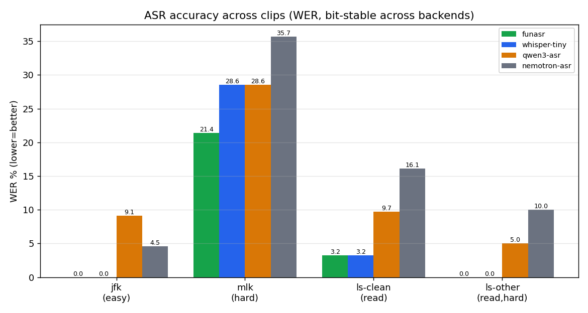

# RLX ASR backend benchmark

Apples-to-apples comparison of the RLX ASR crates across **4 clips × 4 models ×
5 backends**, via the shared driver `rlx_core::asr_bench` (each crate's
`examples/bench_asr.rs`). Same protocol for every model: batch baseline +
chunked-streaming sweep, reporting **WER/CER · RTF · BSF · peak RSS**.

- **Clips** (`.cache/whisper-bench/`, regenerated by `scripts/fetch_whisper_bench.sh`):
  - `jfk` — JFK quote, 11 s (easy oratory, public domain).
  - `mlk` — MLK "I Have a Dream" segment, 12 s (harder oratory; copyrighted → local-only).
  - `ls-clean` — LibriSpeech test-clean utterance, 11 s (clean read speech, CC BY).
  - `ls-other` — LibriSpeech test-other utterance, 10 s (harder read speech, CC BY).
- **Metrics:** WER/CER (lower=better, vs human/canonical reference), **RTF** =
  audio÷wall (higher=faster; >1 beats real-time), BSF = streaming÷batch WER,
  peak RSS via `getrusage`.
- **Backends:** cpu, metal, mlx, gpu (wgpu), ane (CoreML). Apple Silicon.
- **WER is bit-stable across all 5 backends** for every (model, clip) — so the
  accuracy tables list one WER per model×clip; speed/memory vary by backend.

## Accuracy across clips — WER % (lower = better)



| model | jfk | mlk | ls-clean | ls-other | **avg** |
|-------|-----|-----|----------|----------|---------|
| 🥇 **funasr (SenseVoice)** | **0.00** | **21.43** | **3.23** | **0.00** | **6.2** |
| **whisper-tiny** | **0.00** | 28.57 | **3.23** | **0.00** | 8.0 |
| qwen3-asr | 9.09 | 28.57 | 9.68 | 5.00 | 13.1 |
| nemotron-asr | 4.55 | 35.71 | 16.13 | 10.00 | 16.6 |

**funasr/SenseVoice is the most accurate overall** (avg 6.2% WER, wins every
clip). whisper-tiny is a close 2nd and is excellent on read speech (its training
domain) but weaker on MLK. nemotron-asr lags on read speech; qwen3-asr (LLM-ASR)
is mid-pack and degrades under streaming (BSF 2–3×).

## Leaderboard

| metric | winner | value |
|--------|--------|-------|
| ⚡ **Fastest** | **funasr @ mlx** | **RTF 3.9–4.8×** (fastest backend = MLX for all models) |
| 🪶 **Least memory** | **whisper-tiny @ wgpu** | **~1.0 GB** peak |
| 🎯 **Most accurate** | **funasr** | **6.2% avg WER** (best on every clip) |

Speed (best RTF, on MLX) and memory (least, GB at best backend), per model:

| model | best RTF (mlx) | least memory | notes |
|-------|------|------|------|
| **funasr** | **3.9–4.8×** | 3.0 GB @ metal | best all-rounder |
| **whisper-tiny** | 1.9–4.6× | **~1.0 GB @ wgpu** | lightest |
| **nemotron-asr** | 2.1–2.5× | 5.4 GB @ metal | true streaming (BSF 1.0) |
| **qwen3-asr** | 0.9–1.5× | 12.1 GB @ metal | heaviest/slowest (LLM-ASR) |

Per-clip leaderboards + WER/RTFx/RSS charts: `docs/asr/{jfk,mlk,ls-clean,ls-other}/`.

## Backend correctness

**80 model×backend×clip cells, all WER-correct** and bit-stable across backends
(1 cell — qwen3-asr/ane/ls-other — is disk-blocked on this host, not a bug; its
WER is 5.00% like the other 4 backends). Getting here required framework fixes in
`../rlx`:

- **wgpu**: large-param matmul assert; causal decode offset (local→absolute
  query pos); **additive `Bias` vs binary `Custom` mask** split (was breaking
  qwen3-asr's encoder).
- **CoreML**: layout-dispatching attention (split vs fused `[B,S,H·D]`);
  fused-head RoPE; `MaskKind::Custom`; **1D conv length-in-H** (was breaking
  whisper); allow `Device::Ane` in the whisper builder.
- **whisper bench**: force decoder language token (multilingual tiny was
  garbage without it).

## Reproducing

```
scripts/fetch_whisper_bench.sh          # jfk + ls-clean + ls-other (auto, public)
MLK_SRC=/path/to/ihaveadream.wav scripts/fetch_whisper_bench.sh   # + mlk (local)
# bench one model on one clip/backend:
RLX_ASR_MODEL=<dir> RLX_ASR_WAV=.cache/whisper-bench/<clip>_16k.wav \
RLX_ASR_REFERENCE=.cache/whisper-bench/<clip>.reference.txt RLX_ASR_DEVICE=cpu|metal|mlx|gpu|ane \
  cargo run -p <crate> --example bench_asr --release --features metal,mlx,gpu,coreml
# charts + leaderboard:
python3 scripts/asr_charts.py <agg.txt> docs/asr/<clip>
```

Clips live under `.cache/whisper-bench/` (gitignored — regenerable, copyright-safe);
only the fetch recipe + charts are committed. Common Voice / FLEURS / LibriVox
can be added via `CV_SRC`/`FLEURS_SRC`/`LIBRIVOX_SRC` (+ `_REF`) env hooks.
