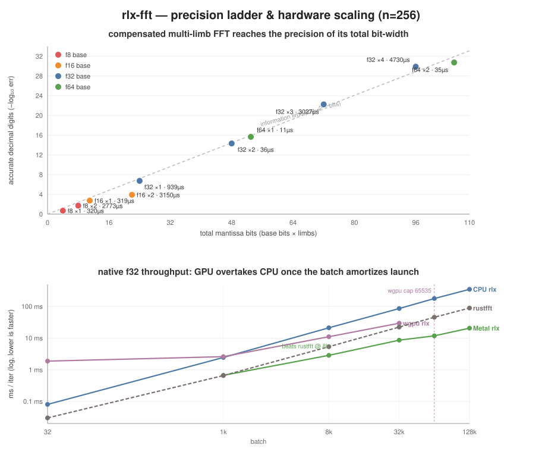
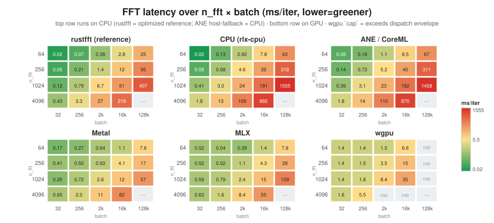

# rlx-fft

Learned butterfly FFT + spectral pipelines (mel, Welch PSD, top-K Welch peaks), compiled via RLX.

**Workspace 0.2.9** — depends on upstream `rlx*` 0.2.10. Publish tier 2 (`scripts/publish.sh`), after `rlx-cli` / `rlx-models-core`.

```bash
cargo run -p rlx-fft --release -- --help
```

## Precision: f4 → f128 on any hardware

The butterfly runs in **compensated multi-limb arithmetic** (error-free transforms built on a single-rounded `Op::Fma`): represent each value as *K* limbs of a base float and the FFT carries the precision of the **total** bit-width — so an accelerator that only has f16 (or f32, or no f64 at all) still reaches f32-, f64-, or f128-grade reconstruction. dd-exact roots of unity keep the twiddles from capping precision.



**Top panel** — every base-float × limb-count lands on the information limit (`digits ≈ log₁₀2 × bits`), independent of which float the hardware natively supports. **Bottom panel** — the native f32 butterfly's throughput crossover across batch 32 → 128k: the `rlx-cpu` backend wins at small batch, Metal overtakes (and beats rustfft) once the batch amortizes GPU launch — at batch 128k Metal is **17× faster than CPU** and **4.3× over rustfft**. wgpu tracks just above rustfft but hits a **hard dispatch cap at batch 65535** (see auto-batch detection below).

### Winners by metric (n=256)

| Goal | Winner | Result |
|------|--------|--------|
| Most precise (any HW) | `f64 ×2` | 1.8e‑31 (≈f128, 106‑bit) @ 35 µs |
| Fastest precise FFT | `f64 ×1` | 2.2e‑16 (f64 grade) @ 11 µs |
| Best precision / cost | `f64 ×1` | 1423 digits·ms⁻¹ |
| Cheapest ≈f64 on **f64‑less** GPU | `f32 ×2` | 4.7e‑15 @ 36 µs |
| Cheapest ≈f128 on **f64‑less** GPU | `f32 ×4` | 1.3e‑30 @ 4.7 ms |
| Best on **f16‑only** NPU/ANE | `f16 ×2` | 1.2e‑4 (≈f32 mantissa) |
| Throughput, batch ≤ 32 | `rlx-cpu` `rlx_op_fft` | 0.08 ms |
| Throughput, batch 128k | Metal `rlx_op_fft` | 20.6 ms — 17× CPU, 4.3× rustfft |
| Cross‑platform / browser GPU | wgpu `rlx_op_fft` | 30 ms @ 32k (dispatch-capped at 65535) |

**Decision rules.** Have f64? Use `f64 ×1` for working precision, `f64 ×2` for f128-grade — both dominate every metric at ~10–35 µs. f64-less GPU (most consumer / mobile / WebGPU)? `f32 ×2` is the workhorse (≈f64 at 36 µs); step to `f32 ×4` only for genuine f128-class needs. f16-only accelerator? `f16 ×2` buys ≈f32 mantissa — the best precision/effort ratio on constrained HW (f8 yields ≤2 digits and is decorative).

### Latency map: n_fft × batch

ms/iter across the `n_fft × batch` grid (to batch **128k**) on all backends, against the **rustfft** CPU reference. Top row runs on CPU (rustfft = optimized reference, `rlx-cpu`, and ANE — which host-falls-back, see note); bottom row is GPU. **Metal** is the scale winner; **MLX** tracks it with a ~0.5 ms small-size floor; **wgpu** has a ~1.4 ms launch floor and a dispatch envelope (`batch · n_fft/32 > 65535`, the `cap` cells); `rlx-cpu`'s general kernel runs ~2–4× the hand-tuned rustfft. `—` = skipped to bound this run's memory.



**rustfft (reference)** — ms/iter

| n_fft ╲ batch | 32 | 256 | 2k | 16k | 128k |
|---|---|---|---|---|---|
| **64** | 0.02 | 0.07 | 0.38 | 2.8 | 25 |
| **256** | 0.05 | 0.21 | 1.4 | 12 | 95 |
| **1024** | 0.12 | 0.79 | 6.7 | 51 | 407 |
| **4096** | 0.43 | 3.3 | 27 | 219 | — |

**CPU (rlx-cpu)** — `rlx_op_fft` ms/iter

| n_fft ╲ batch | 32 | 256 | 2k | 16k | 128k |
|---|---|---|---|---|---|
| **64** | 0.02 | 0.13 | 0.92 | 7.8 | 63 |
| **256** | 0.08 | 0.58 | 4.6 | 39 | 318 |
| **1024** | 0.41 | 3.0 | 24 | 191 | 1555 |
| **4096** | 1.8 | 13 | 109 | 860 | — |

**ANE / CoreML** — ms/iter (host-fallback FFT ⇒ ≈ CPU; all numerically correct, max_err ~1e‑5)

| n_fft ╲ batch | 32 | 256 | 2k | 16k | 128k |
|---|---|---|---|---|---|
| **64** | 0.08 | 0.18 | 1.1 | 8.5 | 67 |
| **256** | 0.14 | 0.72 | 5.2 | 40 | 311 |
| **1024** | 0.39 | 3.1 | 23 | 182 | 1458 |
| **4096** | 1.8 | 14 | 110 | 870 | — |

**Metal** — `rlx_op_fft` ms/iter

| n_fft ╲ batch | 32 | 256 | 2k | 16k | 128k |
|---|---|---|---|---|---|
| **64** | 0.17 | 0.27 | 0.64 | 1.1 | 7.6 |
| **256** | 0.41 | 0.50 | 0.93 | 4.1 | 17 |
| **1024** | 0.26 | 0.72 | 2.6 | 12 | **57** |
| **4096** | 0.65 | 2.0 | 11 | **82** | — |

**MLX** — `rlx_op_fft` ms/iter

| n_fft ╲ batch | 32 | 256 | 2k | 16k | 128k |
|---|---|---|---|---|---|
| **64** | 0.52 | 0.54 | 0.39 | 1.4 | 7.9 |
| **256** | 0.52 | 0.52 | 1.1 | 4.3 | 28 |
| **1024** | 0.59 | 0.79 | 2.4 | 15 | 109 |
| **4096** | 0.63 | 1.6 | 8.4 | 55 | — |

**wgpu** — `rlx_op_fft` ms/iter (`⛔ cap` = exceeds the dispatch envelope; isolate large sizes or use Metal/MLX)

| n_fft ╲ batch | 32 | 256 | 2k | 16k | 128k |
|---|---|---|---|---|---|
| **64** | 1.4 | 1.4 | 1.5 | 6.6 | ⛔ cap |
| **256** | 1.4 | 1.5 | 3.5 | 15 | ⛔ cap |
| **1024** | 1.4 | 1.8 | 8.4 | 35 | ⛔ cap |
| **4096** | 1.6 | 5.5 | ⛔ cap | ⛔ cap | — |

At the heaviest measured cell (`n_fft 4096 × batch 16k`) Metal (82 ms) beats **rustfft** (219 ms) by **2.7×** and `rlx-cpu` (860 ms) by 10.5×; at `1024 × 128k` Metal (57 ms) is **7.1× over rustfft** (407 ms) and 27× over `rlx-cpu`. Below ~batch 256 rustfft on CPU wins on launch overhead — the GPU only pays off once `batch · n_fft` is large.

> **ANE/CoreML FFT note.** `Op::Fft` has no stable MIL/ANE lowering, so on the `ane` device it runs as a **host op** (CPU) — hence the ANE panel ≈ CPU. A batched-FFT bug there (the host path derived the per-row length from the whole buffer, collapsing the batch into one FFT → garbage for batch > 1) was fixed in `rlx-coreml`; ANE FFT is now numerically correct at every size. For real ANE acceleration the FFT still needs a native MIL lowering.

### Reproduce

```bash
# Precision ladder (eager CPU) — prints the full table + 🏆 winners
cargo test --release -p rlx-fft --lib comprehensive_precision_benchmark -- --nocapture

# Hardware × batch (native f32 butterfly across CPU / Metal / WebGPU)
cargo run --release -p rlx-fft --features apple-silicon -- bench-sweep \
  --n-fft 256 --batch 32,1024,8192,32768 --devices cpu,metal,wgpu --with-butterfly-compiled
# CPU + Metal scale past wgpu's 65535 dispatch cap (wgpu rows auto-skip):
cargo run --release -p rlx-fft --features apple-silicon -- bench-sweep \
  --n-fft 256 --batch 65536,131072 --devices cpu,metal --with-butterfly-compiled

# Regenerate the precision/scaling chart from those numbers
python3 scripts/plot_precision_bench.py   # → docs/precision-benchmark.svg

# Latency heatmap — every (device, n_fft, batch) cell runs in its own process so
# a backend cap/panic isolates. Writes device,n_fft,batch,ms,max_err,status.
echo "device,n_fft,batch,ms,max_err,status" > /tmp/grid5.csv
for dev in cpu metal mlx wgpu ane; do for n in 64 256 1024 4096; do for b in 32 256 2048 16384 131072; do
  [ $((n*b)) -gt 268435456 ] && { echo "$dev,$n,$b,,,skip" >> /tmp/grid5.csv; continue; }
  o=$(cargo run -q --release -p rlx-fft --features apple-silicon -- \
        bench --n-fft $n --batch $b --device $dev --iters 3 2>&1) \
    && l=$(echo "$o" | grep 'rlx Op::Fft') \
    && echo "$dev,$n,$b,$(echo "$l"|awk '{print $3}'),$(echo "$l"|grep -oE 'max_err=[0-9.eE+-]+'|cut -d= -f2),ok" >> /tmp/grid5.csv \
    || echo "$dev,$n,$b,,,fail" >> /tmp/grid5.csv
done; done; done
python3 scripts/plot_speed_heatmap.py > /tmp/heatmap_tables.md   # → docs/heatmap-speed.svg
```

### Auto batch sizing

The largest batch a device can run is bounded by two ceilings — **memory** (`batch · n_fft · 2 · elem_bytes · limbs · copies` must fit the working set) and **dispatch** (wgpu/Vulkan reject a compute dispatch above **65535** workgroups/dim — the concrete crash at `batch = 65536`). `max-batch` detects both from the live machine (unified-memory `sysctl` + per-backend grid caps) and reports the safe ceiling:

```bash
cargo run --release -p rlx-fft --features apple-silicon -- max-batch \
  --n-fft 256 --devices cpu,metal,wgpu --dtype f32 --limbs 1
```

```text
max-batch: n_fft=256 dtype=4B limbs=1 row=6144 B/batch
  device     mem budget    dispatch      mem cap    MAX BATCH  limited by  mem source
  cpu            51.2 GB           —      8947848      8947848  Memory      unified memory (hw.memsize × soft fraction)
  metal          51.2 GB           —      8947848      8947848  Memory      unified memory (hw.memsize × soft fraction)
  wgpu           51.2 GB       65535      8947848        65535  Dispatch    unified memory (hw.memsize × soft fraction)
```

`bench-sweep` calls this automatically and **skips** any over-cap `(device, batch)` with a warning instead of panicking. In Rust:

```rust
use rlx_fft::max_batch::{auto_max_fft_batch, clamp_batch, FftProblem};
use rlx_runtime::Device;

let cap = auto_max_fft_batch(Device::Gpu, FftProblem::f32(256));   // → 65535, Dispatch-limited
let (safe, lowered) = clamp_batch(Device::Gpu, FftProblem::new(256, 4, 2), 200_000);
```

`max_fft_batch` is a pure function (unit-tested without hardware); `RLX_FFT_MEM_BUDGET_MB` overrides the budget for discrete-GPU VRAM, and `RLX_SOFT_MEMORY_FRACTION` tunes the unified-memory safety fraction (default 0.80). Source: [`src/max_batch.rs`](src/max_batch.rs).

The compensated representations live in [`src/precision_fft.rs`](src/precision_fft.rs) (`dd_fft`/`f2_fft`/`ex_fft` + roundtrip-error harnesses); `Op::Fma` is native on CPU / WebGPU / Metal and falls back via the `LowerFma` pass on ANE (no MIL fma).

## Welch peaks (fast top-K spikes)

Extract **top-K frequency spikes** `(bin, power)` without materializing a full Welch PSD. The fast path uses **2 Welch segments** (vs 8 in full Welch); an **ultra-fast** path uses **1 segment** for minimum latency.

### CLI bench

```bash
# Auto strategy (default) — picks fastest path for batch + device
cargo run -p rlx-fft --release -- bench-welch-peaks \
  --n-fft 256 --batch 32 --k 16 --train-steps 0

# Batch sweep + Metal GPU crossover
cargo run -p rlx-fft --features apple-silicon --release -- bench-welch-peaks \
  --n-fft 256 --batch 32,256,1024,4096,8192 --device metal --train-steps 0 --iters 15

# Force a specific strategy (see table below)
cargo run -p rlx-fft --release -- bench-welch-peaks \
  --n-fft 256 --batch 32 --strategy ultra

cargo run -p rlx-fft --features apple-silicon --release -- bench-welch-peaks \
  --n-fft 256 --batch 8192 --device metal --strategy rlx

# K sweep — plot latency vs top-K (JSON rows tagged with batch + k)
cargo run -p rlx-fft --features apple-silicon --release -- bench-welch-peaks \
  --n-fft 256 --batch 8192 --k 4,8,16,32,64 --device metal --train-steps 0 --iters 15 \
  --strategy rlx --json /tmp/welch-k-sweep.json
```

Sweep output ends with a **`k crossover`** table (rustfft / stream / rlx / picker ms per K). Combine with `--batch` for a full grid, e.g. `--batch 32,8192 --k 4,16,64`.

### Fusion phase bench (IO + latency)

Compare baseline interleaved readback, Phase 1 block layout, and Phase 2 fused `Op::WelchPeaks`:

```bash
cargo run -p rlx-fft --features dev,apple-silicon --release -- bench-fusion-phases \
  --n-fft 256 --batch 8192 --k 16 --device metal --iters 15

# Batch sweep + JSON
cargo run -p rlx-fft --features dev,apple-silicon --release -- bench-fusion-phases \
  --n-fft 256 --batch 32,1024,8192 --k 16 --device metal --iters 15 \
  --json /tmp/fusion-phases.json
```

Output includes **IO profiles** (kernel launches, sync points, host readback bytes) and per-phase speedup vs baseline.

```bash
# WGPU (Vulkan/Metal/DX12 via wgpu)
cargo run -p rlx-fft --features dev,gpu --release -- bench-fusion-phases \
  --n-fft 256 --batch 8192 --k 16 --device wgpu --iters 15

# CUDA (when NVIDIA toolkit + `rlx-runtime/cuda` available)
cargo run -p rlx-fft --features dev,cuda --release -- bench-fusion-phases \
  --n-fft 256 --batch 8192 --k 16 --device cuda --iters 15
```

| Phase | Path | What changes |
|-------|------|--------------|
| baseline | `baseline_interleaved_readback` | Full FFT spectrum readback + host top-K |
| Phase 1 | `phase1_block_layout` | Block-layout FFT output; peaks on host |
| Phase 2 | `phase2_fused_welch_peaks_op` | Fused graph; peaks-only readback (~32× less host_out at batch=8192). Metal runs peaks after a single GPU wait (no mid-graph sync). |
| Phase 3 | `phase3_compile_peaks_output_gate` | `SelectPeaksOnlyOutputs` compile pass when IO gate favors fusion |
| Phase 5 | native `WelchPeaks` GPU kernel | CUDA + WGPU in-arena PSD + top-K (no tail-host thunk at large batch); tune scale via `rig.sh bench-rlx-fft-welch-peaks` |

| Flag | Default | Description |
|------|---------|-------------|
| `--n-fft` | `256` | FFT size |
| `--batch` | `32` | Batch size, CSV (`32,1024`), or power-of-two range (`32-8192`) |
| `--k` | `16` | Peaks per row; CSV (`4,8,16,32`) or power-of-two range (`4-64`) for K sweep |
| `--device` | `auto` | `cpu`, `metal`, `cuda`, … |
| `--strategy` | `auto` | `auto`, `ultra`, `fast`, `rlx`, `learned` |
| `--train-steps` | `200` | Train a lightweight learned model (`0` to skip); uses `--k` for peak loss |
| `--iters` | `50` | Timing iterations |
| `--no-compiled` | — | Skip explicit RLX/learned compiled baseline rows |
| `--no-ultra-fast` | — | Skip ultra-fast baseline row |
| `--json PATH` | — | Write JSON report |

Bench output includes a **`welch_peaks_picker_<strategy>`** row using auto or forced selection, e.g.:

```text
[welch-peaks] picker (auto): batch=8192 device=Metal -> rlx_compiled
```

### Strategy picker

Use **`AutoWelchPeaks`** in Rust or **`--strategy`** on the CLI.

| Strategy | Label | When to use |
|----------|-------|-------------|
| **auto** | (resolved at runtime) | Default — picks from batch + device |
| **ultra** | `ultra_fast_rustfft` | Smallest batch, lowest latency (1 segment) |
| **fast** | `fast_streaming_rustfft` | CPU / mid batch; best accuracy vs speed on rustfft |
| **rlx** | `rlx_compiled` | Large batch on GPU (Metal/CUDA/…) |
| **learned** | `learned_compiled` | Large batch + sparse learned gates + trained model |

#### Auto selection (IO-aware picker)

Auto mode estimates each strategy with an **Ayala-style latency–bandwidth model** (`T ≈ L·M + S/W`) using `graph_io` profiles and per-device `BackendCostModel` (CPU rustfft paths vs fused `Op::WelchPeaks` on GPU). Fused GPU estimates apply a calibrated compute scale (~7.5× IO-only on Metal, from `bench-fusion-phases` phase-2); CPU rustfft gets a batch growth penalty when compared on GPU devices. It picks the lowest predicted cost.

| Env | Effect |
|-----|--------|
| `RLX_FFT_PICKER_TRACE=1` | Log per-strategy predicted ms when constructing `AutoWelchPeaks` |
| `RLX_FFT_LEGACY_PICKER=1` | Restore fixed thresholds (`8192` GPU crossover, etc.) |

Calibrate with `bench-fusion-phases` (phase-2 fused vs IO-model line; prints `suggested fused_io_compute_scale`) and `bench-welch-peaks` (picker vs rustfft crossover). NVIDIA CUDA: `../rlx/rig.sh bench-rlx-fft-welch-peaks windows 256,1024,8192 cuda` or quick picker check `../rlx/rig.sh bench-welch-peaks-fft windows 8192 cuda` (Mar 2026 rig: CUDA scale **0.43**, auto picker → `rlx_compiled` / `FusedOp` **~19 ms** vs rustfft **~63 ms** at batch 8192). Metal/Mlx use unified-memory rustfft penalties. WGPU/Vulkan use native in-arena `WelchPeaks` at large batch; preliminary WGPU scale ~2.2. `welch_peaks_io_fusion_gate` / `welch_peaks_fusion_gate_breakdown` use `rlx_compile::IoFusionGate` (readback savings minus host-thunk penalty). At compile time, `rlx_compile::SelectPeaksOnlyOutputs` runs in the fusion pipeline when the backend claims `Fft` + `WelchPeaks`: it drops redundant spectrum outputs and promotes peaks-only readback when the IO gate favors fusion (`bench-fusion-phases` **phase3** row). `welch_peaks_fusion_gate_breakdown` exposes `should_fuse_io` vs final `should_fuse` (adds a large-batch compute floor vs block RLX). Auto picker only estimates `rlx` / `learned` when **both** `fused_welch_peaks_auto_viable` and the IO gate pass (Metal rejects fusion below ~batch 512). At runtime, `CompiledRlxWelchPeaksExec::compile_adaptive` picks fused `Op::WelchPeaks` or block FFT + host top-K (`rlx_welch_peaks_exec_kind`). `AutoWelchPeaks::welch_peaks_batch` accepts full 8-segment or fast 2-segment layout; use `welch_peaks_batch_fast` when you already have the fast buffer.

```bash
just features=apple-silicon bench-welch-peaks -- --n-fft 256 --batch 1024,8192 --k 16 --device metal
just bench-fusion-phases -- --n-fft 256 --batch 1024,8192 --k 16 --device metal --iters 15
```

Legacy reference thresholds (used only with `RLX_FFT_LEGACY_PICKER`): `batch ≤ 256` CPU / `≤ 128` GPU → **ultra**; mid batch → **fast**; `batch ≥ 8192` GPU → **rlx**; sparse learned gates → **learned**.

**Reference peaks** for training/bench error always use full 8-segment Welch; student paths use 1–2 segments.

### Rust API

```rust
use rlx_fft::{
    AutoWelchPeaks, WelchPeaksPickMode, WelchPeaksStrategy,
    parse_welch_peaks_strategy, pick_welch_peaks_strategy,
};

// Auto (recommended)
let mut picker = AutoWelchPeaks::new(batch, n_fft, k, Some("auto"))?;
println!("strategy: {}", picker.strategy_label());

// Force a strategy
let mut picker = AutoWelchPeaks::with_strategy(
    batch, n_fft, k, Some("metal"), WelchPeaksStrategy::RlxCompiled,
)?;

// Parse CLI-style string
let mode = parse_welch_peaks_strategy("fast")?; // Force(FastStreaming)
let mut picker = AutoWelchPeaks::with_options(
    batch, n_fft, k, Some("cpu"), None, mode,
)?;

// With learned model (for learned strategy or auto sparse-gate path)
let mut picker = AutoWelchPeaks::with_learned(
    batch, n_fft, k, Some("metal"), Some(&model),
)?;

// Full 8-segment layout (e2e / reference pipelines)
let peaks = picker.welch_peaks_batch(&signal)?;

// Fast 2-segment layout (production hot path — no truncate copy)
let fast_signal = fast_params.welch.truncate_batch(&signal, batch, full_frame)?;
let peaks = picker.welch_peaks_batch_fast(&fast_signal)?;
```

**Strategy string aliases** (for `parse_welch_peaks_strategy` / `--strategy`):

| Input | Maps to |
|-------|---------|
| `auto` | Auto pick |
| `ultra`, `ultra-fast`, `1seg` | UltraFast |
| `fast`, `streaming`, `rustfft`, `2seg` | FastStreaming |
| `rlx`, `compiled`, `gpu` | RlxCompiled |
| `learned`, `learned_compiled` | LearnedCompiled |

### Performance notes (n=256, Apple Silicon reference)

| Batch | Best auto pick (typical) | vs full Welch |
|-------|--------------------------|---------------|
| 32 | ultra (~0.04 ms CPU) | ~4–5× faster |
| 1024 | fast streaming | ~3× faster |
| 8192 | rlx Metal (~40 ms) | ~2× faster than rustfft fast at this batch |

RLX compiled paths need **large batch** to amortize GPU launch; rustfft wins at small batch.

### Training peaks into the learned model

End-to-end training includes a peak-matching loss on the fast 2-segment path. **`--k` / `--peak-k`** sets how many spikes are matched during training and at inference (learned, compiled-learned, and picker `learned` strategy).

```bash
cargo run -p rlx-fft --release -- train-e2e \
  --n-fft 256 --batch 8 --peak-k 16 --peak-weight 2.0 --steps 2000

# bench-e2e: same K for WelchPeaks pipelines + teacher training
cargo run -p rlx-fft --release -- bench-e2e \
  --n-fft 256 --batch 8 --peak-k 8 --train-first --steps 500
```

At inference, `FastLearnedFftModel::welch_peaks_batch` accepts any `WelchPeakParams::fast_for_n_fft(n_fft, k)` — K is not baked into weights, but training with the target K improves peak accuracy.

### Tests

```bash
just features=apple-silicon test-rlx-fft-welch-peaks
just test-rlx-fft-fusion-gate
cargo test -p rlx-fft welch_peaks_compile::tests --features apple-silicon
```

### Modules

| Module | Role |
|--------|------|
| `peak` | `WelchPeakParams`, streaming top-K, `WelchPeaksScratch` |
| `welch_peaks_picker` | `AutoWelchPeaks`, auto/forced strategy, `picker_path_label` |
| `welch_peaks_cost` | Ayala IO model, `welch_peaks_fusion_gate_breakdown`, `fused_welch_peaks_auto_viable` |
| `welch_peaks_compile` | `CompiledRlxWelchPeaksExec` (adaptive fused/block), learned path |
| `bench_welch_peaks` | CLI bench — picker (full + `fastbuf` hot path), adaptive RLX, forced fused baseline |
| `bench_fusion_phases` | Fusion phase bench (`--features dev`; baseline vs block layout vs fused op) |
