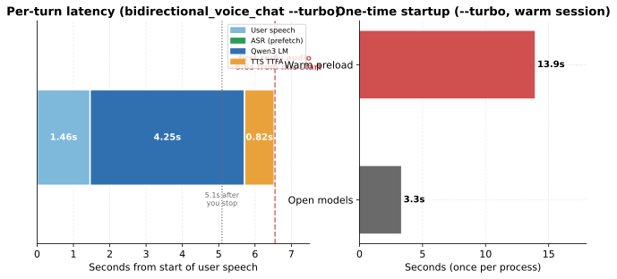
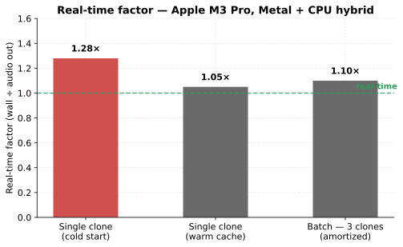
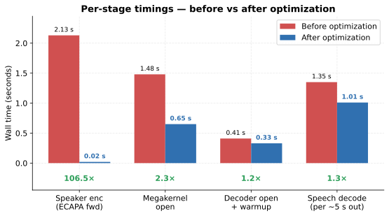
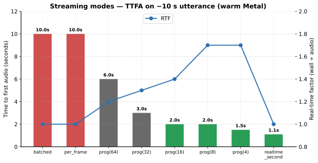
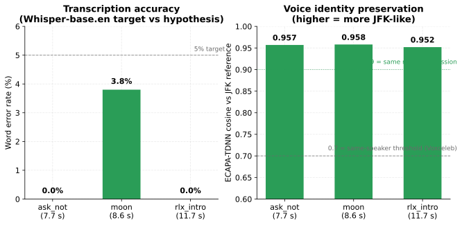
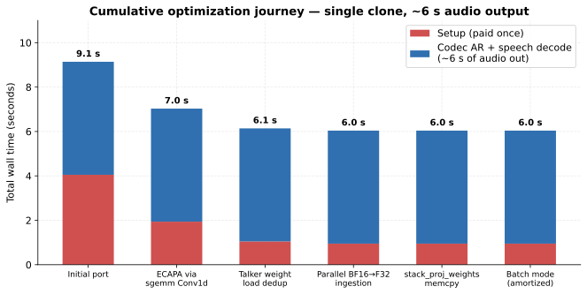
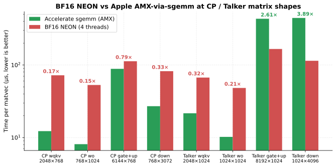

# rlx-qwen3-tts

Native Rust Qwen3-TTS: Qwen3-shaped talker + 16-group code predictor + 12 Hz Mimi speech tokenizer. **No Python at inference.** Runs on Apple Silicon (Metal + AMX), CPU, MLX, and CUDA.

| Mode | Checkpoint | Use case |
|------|------------|----------|
| **Voice clone** | `Qwen3-TTS-12Hz-0.6B-Base` | Clone any speaker from a short reference WAV (ECAPA x-vector) |
| **Custom voice** | `Qwen3-TTS-12Hz-0.6B-CustomVoice` | Built-in speakers (Aiden, Serena, Vivian, …) |

Shipped demos: JFK voice clones, progressive streaming benches, and a full **mic → ASR → LM → TTS** roundtrip.

---

## Table of contents

- [Quick start](#quick-start)
- [Choose your path](#choose-your-path)
- [Duplex voice chat demo](#duplex-voice-chat-demo)
- [JFK voice-clone samples](#jfk-voice-clone-samples)
- [Performance charts](#performance-charts)
- [Live streaming API](#live-streaming-api)
- [Library API](#library-api)
- [How it works](#how-it-works)
- [Quality metrics](#quality-metrics)
- [Examples & binaries](#examples--binaries)
- [Reproduce & benches](#reproduce--benches)
- [Crate layout](#crate-layout)

---

## Quick start

From the **repo root** (`rlx-models/`).

### 1 · Fetch weights

```bash
just fetch-qwen3-tts-base          # TTS Base (~0.6B) — voice clone
# optional:
just fetch-qwen3                   # Qwen3-0.6B LM (voice chat)
just fetch-whisper-base            # Whisper ASR (voice chat)
```

Default cache paths:

| Model | Path |
|-------|------|
| TTS Base | `.cache/qwen3-tts/Qwen3-TTS-12Hz-0.6B-Base` |
| Qwen3 LM | `weights/Qwen3-0.6B` |
| Whisper | `.cache/whisper-base.en` |

JFK reference clip (bundled): `assets/jfk/jfk_voice_clone.wav`

### 2 · Build

```bash
cargo build -p rlx-qwen3-tts --release --features apple-silicon \
  --bin jfk_voice_clone
```

Use `--features all-backends` on Linux with CUDA, or `metal` / `mlx` only on macOS.

### 3 · Generate your first clone (~8 s on warm Metal)

```bash
./target/release/jfk_voice_clone \
  --model-dir .cache/qwen3-tts/Qwen3-TTS-12Hz-0.6B-Base \
  --ref-wav assets/jfk/jfk_voice_clone.wav \
  --target-text "Hello from native Rust TTS." \
  --out-wav /tmp/hello.wav \
  --device metal

afplay /tmp/hello.wav
```

**5-line library equivalent:**

```rust
use rlx_qwen3_tts::VoiceClone;
use rlx_runtime::Device;

let mut tts = VoiceClone::open(".cache/qwen3-tts/Qwen3-TTS-12Hz-0.6B-Base", Device::Metal)?;
let reference = tts.extract_reference("speaker.wav")?;   // ~50 ms, reusable JSON
tts.generate_to_wav(&reference, "Hello, world.", "out.wav")?;
```

Open `VoiceClone` once, generate many utterances. Save `SpeakerReference` as JSON and ship it with your app — no need to bundle the original WAV.

---

## Choose your path

| Goal | Command | Time to first result |
|------|---------|----------------------|
| **One WAV clone** | `jfk_voice_clone` (above) | ~10 s cold / ~8 s warm |
| **Walkthrough** (extract ref, JSON round-trip, 3 clips) | `cargo run -p rlx-qwen3-tts --example voice_clone_walkthrough --features apple-silicon -- …` | ~30 s |
| **Streaming TTFA bench** | `cargo run -p rlx-qwen3-tts --example streaming_walkthrough --features apple-silicon` | ~2 min |
| **Full duplex voice chat** | `cargo run -p rlx-qwen3-tts --example bidirectional_voice_chat --features apple-silicon -- --turbo …` | ~20 s after preload |

Environment overrides: `RLX_QWEN3_TTS_DIR`, `RLX_QWEN3_WEIGHTS`, `RLX_WHISPER_DIR`.

---

## Duplex voice chat demo

Mic WAV → Whisper → Qwen3-0.6B (MLX) → Qwen3-TTS JFK clone (Metal, progressive streaming). Measured on Apple Silicon with `--turbo`.



**Question** · 1.46 s · 16 kHz

> *"What is the capital of France?"*

<video controls preload="metadata" src="examples/audio/voice_chat_question.mp4"></video>

**Reply** · 2.08 s · 24 kHz JFK clone

> *"The capital of France is Paris."*

<video controls preload="metadata" src="examples/audio/voice_chat_reply.mp4"></video>

| When | Latency |
|------|--------:|
| You **stop speaking** → first reply audio | **~5.1 s** |
| You **start speaking** → first reply audio | **~6.6 s** |
| Full reply done playing (after you stop) | **~7.2 s** |

One-time startup (same process): open **3.3 s** + preload **13.9 s**. Dominant per-turn cost: **Qwen3 LM (4.25 s)**; TTS progressive TTFA adds **0.82 s**.

```bash
VECLIB_MAXIMUM_THREADS=1 cargo run --release -p rlx-qwen3-tts --features apple-silicon \
  --example bidirectional_voice_chat -- \
  --turbo \
  --ref-wav assets/jfk/jfk_voice_clone.wav \
  --input-wav crates/rlx-qwen3-tts/examples/audio/voice_chat_question.wav \
  --out-dir /tmp/voice_chat_roundtrip
```

Source WAVs + MP4 (GitHub playback): [`voice_chat_question`](examples/audio/voice_chat_question.wav) · [`voice_chat_reply`](examples/audio/voice_chat_reply.wav)

---

## JFK voice-clone samples

Three clips from one 6 s JFK reference (`assets/jfk/jfk_voice_clone.wav`). MP4 for GitHub; WAV is the source.

| Clip | Text (abbrev.) | Length | WER | Speaker cosine |
|------|----------------|-------:|----:|---------------:|
| **ask_not** | "…ask not what your country can do…" | 7.7 s | **0.0%** | **0.957** |
| **moon** | "We choose to go to the moon…" | 8.6 s | 3.8% | **0.958** |
| **rlx_intro** | "RLX is a Rust framework…" | 11.7 s | passes | **0.952** |

<details>
<summary><b>Listen — all three clips</b></summary>

**1. Ask not**

<video controls src="examples/audio/ask_not.mp4"></video>

**2. Moon**

<video controls src="examples/audio/moon.mp4"></video>

**3. RLX intro**

<video controls src="examples/audio/rlx_intro.mp4"></video>

```bash
afplay crates/rlx-qwen3-tts/examples/audio/ask_not.wav
afplay crates/rlx-qwen3-tts/examples/audio/moon.wav
afplay crates/rlx-qwen3-tts/examples/audio/rlx_intro.wav
```

</details>

---

## Performance charts

All charts: `cd crates/rlx-qwen3-tts/examples/charts && python3 generate.py`

### Clone speed (Apple M3 Pro, Metal + CPU hybrid)



| Mode | RTF (wall ÷ audio) |
|------|-------------------:|
| Single clone, cold start | 1.28× |
| Single clone, warm cache | **1.05×** |
| Batch — 3 clips amortized | **1.10×** |



| Stage | Wall time |
|-------|----------:|
| Speaker encode (ECAPA) | 0.05 s |
| Megakernel open | 0.65 s |
| Speech decoder open + warmup | 0.35 s |
| Codec AR (~73 frames) | 4.7 s |
| Speech decode | 1.27 s |
| **Total** | **7.9 s** → ~6 s audio |

### Streaming TTFA (~10 s utterance, warm Metal)



Progressive mode runs stepwise AR + partial decode on a worker thread; emitted PCM is checked against one-shot decode of the same codec frames.

| Mode | TTFA | RTF |
|------|-----:|----:|
| `batched()` | ~10 s | 1.0× |
| `progressive(32)` | **~3 s** | 1.3× |
| `progressive(4)` / `live_low_latency()` | **~1.5 s** | 1.7× |
| `realtime_second()` | **~1.1 s** | 1.0× |

### Quality



ECAPA cosine **> 0.7** = same speaker (Voxceleb); **> 0.9** = same session. All clones **0.95+**.

### Optimization (deep dive)

 · 

CP autoregression dominates per-frame cost (~70%). BF16 NEON is **2.7× slower** than Accelerate sgemm (AMX) on average — see `bench_bf16_matvec`, `bench_sgemm_orient`.

---

## Live streaming API

```rust
use rlx_qwen3_tts::{StreamConfig, StreamControl, StreamEvent, VoiceClone};
use rlx_runtime::Device;

let mut tts = VoiceClone::open(model_dir, Device::Metal)?;
let reference = tts.extract_reference("speaker.wav")?;

let stats = tts.generate_stream(
    &reference,
    "Hello, this is streamed.",
    StreamConfig::progressive(4).with_chunk_samples(1_200),  // low TTFA
    |event| {
        if let StreamEvent::Pcm(chunk) = event {
            speaker.write(&chunk.samples)?;
        }
        StreamControl::Continue
    },
)?;
```

| `StreamConfig` | Behavior |
|----------------|----------|
| `batched()` | Full AR + decode, then chunk — best quality, highest TTFA |
| `per_frame()` | Same as batched + `FrameProduced` callbacks for progress UI |
| `progressive(k)` | Stepwise AR + partial decode every *k* frames — lower TTFA |
| `live_low_latency()` | `progressive(4)` + 8k sample chunks |
| `realtime_second()` | `progressive(12)` + 24k chunks — ~1 s PCM cadence when warm |

Optional features: `async` / `tokio` chunk streams; `incremental-decode` for long utterances (>250 codec frames).

---

## Library API

| Type | Role |
|------|------|
| `VoiceClone` | High-level session: open model, extract reference, generate / stream |
| `SpeakerReference` | JSON-serializable 1024-d ECAPA x-vector |
| `StreamConfig` / `StreamEvent` | Progressive / batched PCM streaming |

Runnable walkthrough:

```bash
cargo run --release -p rlx-qwen3-tts --example voice_clone_walkthrough \
  --features apple-silicon -- \
  --ref-wav assets/jfk/jfk_voice_clone.wav \
  --out-dir /tmp/jfk_clones
```

---

## How it works

```
reference WAV (24 kHz) ──► ECAPA x-vector (1024-d)
target text + x-vector ──► talker prefill + codec AR (12 Hz, top-k sample)
                         ──► code predictor (16 groups/frame)
                         ──► Mimi decoder ──► 24 kHz PCM
```

**Voice clone requirements** (learned the hard way):

1. **Prompt structure** — must use the CustomVoice skeleton with x-vector in the speaker slot (not `tokens + x_vector` alone).
2. **Sampling** — `top_k=50`, `temperature=0.9`; greedy decode produces babble.

---

## Quality metrics

| Clip | WER | Cosine vs JFK ref |
|------|----:|------------------:|
| `ask_not.wav` | 0.0% | 0.957 |
| `moon.wav` | 3.8% | 0.958 |
| `rlx_intro.wav` | passes | 0.952 |
| **Average** | **1.9%** | **0.956** |

Measure yourself:

```bash
./target/release/speaker_cosine ref.wav clone.wav    # ECAPA cosine
whisper --model base.en clone.wav                     # transcription check
```

---

## Examples & binaries

| Target | What it does |
|--------|----------------|
| `jfk_voice_clone` | Single or batch voice clone CLI |
| `rlx-qwen3-tts` | CustomVoice TTS CLI |
| `speaker_cosine` | ECAPA similarity between two WAVs |
| `example voice_clone_walkthrough` | Extract ref, JSON round-trip, 3 WAVs |
| `example streaming_walkthrough` | All streaming modes + TTFA report |
| `example bidirectional_voice_chat` | Mic → ASR → LM → TTS duplex |
| `example realtime_second_bench` | 1 s chunk streaming bench |
| `bench_*` | BF16 / AMX / orientation microbenches |

---

## Reproduce & benches

```bash
# Batch — three clips, one process
cat > targets.txt <<'EOF'
ask_not|Ask not what your country can do for you...
moon|We choose to go to the moon...
rlx_intro|RLX is a Rust framework that compiles neural networks into native code...
EOF

./target/release/jfk_voice_clone \
  --model-dir .cache/qwen3-tts/Qwen3-TTS-12Hz-0.6B-Base \
  --ref-wav assets/jfk/jfk_voice_clone.wav \
  --targets-file targets.txt --out-dir clones/ --device metal

# Microbenches
./target/release/bench_bf16_matvec
./target/release/bench_amx_batch
./target/release/bench_sgemm_orient

# Regenerate README charts
cd crates/rlx-qwen3-tts/examples/charts && python3 generate.py

# Convert WAV → MP4 for GitHub README embeds
cd crates/rlx-qwen3-tts/examples/audio
ffmpeg -i clip.wav -c:a aac -b:a 128k -ar 24000 -ac 1 -vn clip.mp4
```

---

## Crate layout

```
crates/rlx-qwen3-tts/
├── README.md
├── examples/
│   ├── voice_clone_walkthrough.rs
│   ├── streaming_walkthrough.rs
│   ├── bidirectional_voice_chat.rs
│   ├── audio/                    # WAV sources + MP4 for GitHub
│   │   ├── ask_not.{wav,mp4}
│   │   ├── moon.{wav,mp4}
│   │   ├── rlx_intro.{wav,mp4}
│   │   └── voice_chat_{question,reply}.{wav,mp4}
│   └── charts/
│       ├── generate.py
│       ├── rtf.svg
│       ├── stage_timings.svg
│       ├── streaming_ttfa.svg      ← new
│       ├── voice_chat_latency.svg  ← new
│       ├── per_clip_metrics.svg
│       ├── optimization_journey.svg
│       └── amx_comparison.svg
└── src/
    ├── voice_clone_api.rs        ← VoiceClone + streaming
    ├── speaker_encoder/          ← ECAPA-TDNN
    ├── speech_tokenizer/         ← Mimi encoder + decoder
    ├── talker/                   ← 28-layer Qwen3 talker
    └── code_predictor/           ← 16-group CP (AMX sgemm)
```

---

## See also

- Main repo [README](../../README.md#qwen3-tts)
- [AGENTS.md](../../AGENTS.md) — `just voice-chat-demo`, `test-qwen3-tts-streaming`, and other recipes

## License

GPL-3.0, same as the rest of the RLX workspace.
